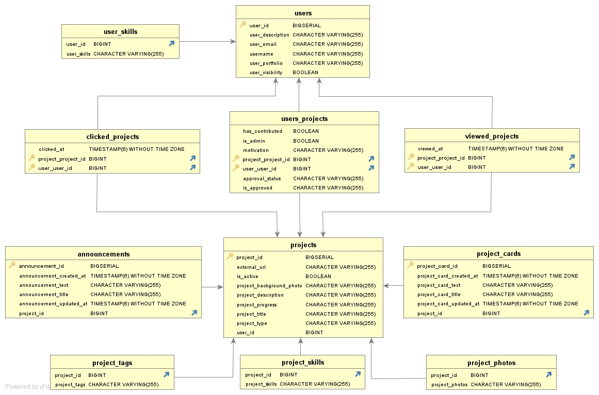

# Lagalt REST API

----

## Overview

Spring Boot REST API with PostgreSQL implemented using Hibernate and secured with Firebase.  

It is the back-end part of the [Lagalt](https://lagaltno.herokuapp.com/) application.

## Group Members

Front-end | Back-end
----------|---------
Ahmad Abdulal | Lucas Due
Nuno Cunha | Vytautas Zarauskas

## Description

The project is a Spring Boot REST API with PostgreSQL database implemented using Hibernate and secured with Firebase. It serves as a back-end part for the [Lagalt](https://lagaltno.herokuapp.com/) application. The API is deployed on Heroku with continuous integration and deployment from GitHub.  

It contains users, projects, announcements and project cards, which all have the basic ***CRUD*** (Create, Read, Update and Delete) functions. There are numerous supplementary entities, such as clicked projects and viewed projects.  

Additional endpoints include:

- A ***new content algorithm*** that provides suggestions for logged-in users based on projects that they have previously contributed to, clicked on or viewed. It also accounts for user's skills and also suggests other active projects if there are no related ones to suggest.
- A ***flexible search and filter function*** that has a search functionality for matches across project title, type, description, required skills and tags. It also allows filtering by industry and project status as well as limiting the amount of search results. In addition, it serves as an endpoint to fetch projects for anonymous users.
- A ***toggle function*** to change the status of a project whether it's active or inactive.
- A ***custom query function*** to fetch data on user related projects from multiple tables.

Some points of note:
- adhering to REST API conventions (including layering and versioning)
- optimizing business logic for performance
- handling attempts of adding duplicate objects into the database, and it's relations

## Getting started
### Step 1
Clone the project `git clone https://github.com/nightfrost/Lagalt-API.git`.

### Step 2
Open the project and download the dependencies (the download should start automatically).

### Step 3
Configure and connect a database.  

If PostgreSQL is used, just modify *application.properties* file accordingly. If another database is used, both the *pom.xml* (dependency for the choice of a database) and *application.properties* need to be configured accordingly.  
It is advisable to store the password to the connected database in *application-local.properties* file and include it in *.gitignore* (refer to *application-prod.properties* file for a format).

### Step 4
Security.

If authentication and authorization is to be used, create an account on [Firebase](https://firebase.google.com/) and extract the Firebase config. Replace it with the *firebase_config.json* file in resources. Modify *application.properties* file accordingly.

If, however, project is to be used without security, remove the *auth* package from the source root (remove *firebase_config.json* file from resources and security related configurations in *application.properties* file).  

### Step 5
Run the application.

## __Documentation__

### API documentation

Documentation was made using Postman and can be found at:

NOTE: The application is secured and needs a valid bearer token. The one provided in the documentation is expired.

### Database diagram

